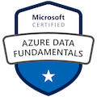

---
# the default layout is 'page'
icon: fas fa-info-circle
order: 4
---

### 👨‍💻 About me:

- I am a cloud engineer working in the Cloud Center of Excellence deparment in a large organization in the automotive industry
- I specialize in Azure cloud and in governance and automation of various solutions in Azure
- I mainly work with powershell and terraform and I am learning python as well

---

### 🛠️ Certifications:

---

### 🔥 My stats:

